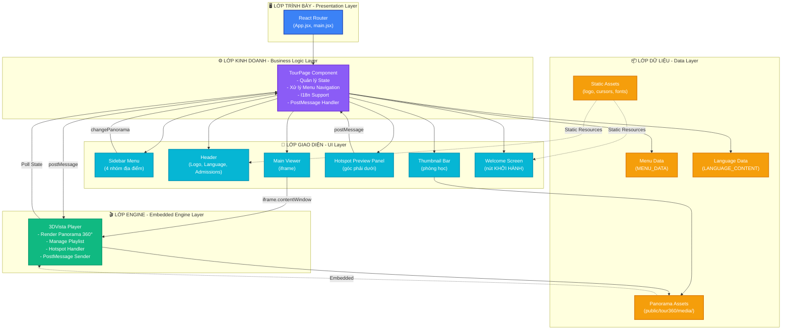

# Kiến Trúc Tổng Quan Của Hệ Thống

## I. MÔ HÌNH KIẾN TRÚC TỔNG QUAN

### 1.1 Mô Hình Kiến Trúc Được Áp Dụng

Hệ thống VJU Virtual Tour áp dụng mô hình kiến trúc **Shell + Embedded Engine** – một biến thể của kiến trúc **Layered Architecture** (Kiến trúc nhiều lớp). Cụ thể, hệ thống gồm hai thành phần chính:

- **Lớp Shell (Vỏ bên ngoài)**: Được xây dựng bằng React, đóng vai trò như một ứng dụng Single Page Application (SPA) quản lý giao diện người dùng, điều hướng, và trạng thái toàn cục.
- **Embedded Engine (Engine nhúng)**: Là thành phần 3DVista được nhúng thông qua iframe, chuyên xử lý render panorama 360 độ, quản lý danh sách phát, và tương tác với hotspot.

### 1.2 Lý Do Kiến Trúc Này Phù Hợp

Mô hình Shell + Embedded Engine được lựa chọn với những lý do sau:

**a) Tách biệt trách nhiệm (Separation of Concerns):**
- React chỉ tập trung vào quản lý UI và logic nghiệp vụ ở tầng ứng dụng (menu navigation, i18n, state management).
- 3DVista chuyên xử lý những phần phức tạp của đồ họa 3D mà không cần phát triển lại từ đầu.

**b) Tối ưu thời gian phát triển:**
- Sử dụng engine 3DVista ready-made giúp tiết kiệm nhân lực và thời gian so với việc xây dựng engine tour 360 độ từ đầu.
- Nhóm phát triển có thể tập trung vào trải nghiệm người dùng thay vì tối ưu hóa đồ họa.

**c) An toàn và độ lập độc (Isolation):**
- iframe tạo ra một ranh giới rõ ràng giữa hai thành phần, ngăn chặn xung đột context giữa React bundle và 3DVista library.
- Lỗi trong 3DVista không ảnh hưởng trực tiếp đến state management của React.

**d) Khả năng mở rộng và bảo trì:**
- Nếu cần thay thế 3DVista, việc này có thể được thực hiện mà không cần refactor toàn bộ mã React.
- Giao tiếp giữa hai thành phần thông qua postMessage API rõ ràng và dễ mở rộng.

---

## II. CÁC THÀNH PHẦN CHÍNH CỦA HỆ THỐNG

Hệ thống được chia thành năm thành phần lớn, được sắp xếp theo kiến trúc nhiều lớp:

### 2.1 Lớp Trình Bày (Presentation Layer)

**Thành phần:** React SPA + React Router

**Vị trí:** `frontend/src/App.jsx`, `frontend/src/main.jsx`

**Vai trò và Chức năng:**
- Khởi tạo và render ứng dụng React vào DOM bằng ReactDOM.
- Định tuyến (routing) các đường dẫn URL đến các trang tương ứng (hiện tại chỉ có trang duy nhất là TourPage).
- Cung cấp framework để sau này có thể mở rộng thêm các trang khác (ví dụ: trang đăng nhập, trang admin).

### 2.2 Lớp Kinh Doanh (Business Logic Layer)

**Thành phần:** TourPage Component

**Vị trí:** `frontend/src/pages/TourPage.jsx`

**Vai trò và Chức năng:**
- **Quản lý trạng thái toàn cục** của ứng dụng thông qua React State:
  - `activeIndex`: Chỉ số panorama hiện tại đang được hiển thị.
  - `language`: Ngôn ngữ được chọn (Tiếng Việt hoặc Tiếng Anh).
  - `isSidebarOpen`: Trạng thái mở/đóng của sidebar menu.
  - `hotspotPreview`: Dữ liệu hotspot được xem trước (tên, mô tả, hình ảnh).
  - `isStarted`: Cờ chỉ định tour đã bắt đầu hay chưa.

- **Xử lý tương tác người dùng:**
  - Nhận lệnh từ menu sidebar khi người dùng chọn địa điểm.
  - Gửi lệnh đến iframe 3DVista để chuyển panorama bằng hàm `setMediaByIndex(index)`.
  - Poll trạng thái từ 3DVista (mỗi 150ms) để cập nhật `activeIndex` khi người dùng tự quay vòng (pan/zoom).

- **Hỗ trợ quốc tế hóa (Internationalization):**
  - Cung cấp bản dịch cho giao diện (VI/EN).
  - Chuyển đổi ngôn ngữ trong giao diện khi người dùng thay đổi cài đặt.

- **Giao tiếp với iframe:**
  - Gửi postMessage để yêu cầu 3DVista thực hiện hành động.
  - Lắng nghe sự kiện từ 3DVista (như xem trước hotspot).

### 2.3 Lớp Giao Diện Người Dùng (UI Layer)

**Thành phần:** Các phần tử UI được render bởi React Component

**Vị trị:** `frontend/src/pages/TourPage.jsx` (JSX markup)

**Vai trò và Chức năng:**

Lớp này bao gồm các phần tử giao diện chính:

- **Sidebar Menu (Thực đơn bên trái):**
  - Hiển thị danh sách 4 nhóm địa điểm (Khuôn viên trường, Khu tiện ích, Hệ thống phòng học, Hành chính).
  - Cho phép người dùng chọn địa điểm để ghé thăm.
  - Hỗ trợ mở/đóng responsive theo kích thước màn hình.

- **Header (Thanh tiêu đề):**
  - Hiển thị logo VJU.
  - Nút chuyển ngôn ngữ (VI/EN).
  - Nút "Thông tin tuyển sinh" (liên kết bên ngoài).

- **Main Viewer (Khu vực xem chính):**
  - Nhúng iframe chứa tour 360 độ.
  - Chiếm phần lớn diện tích màn hình.

- **Hotspot Preview Panel (Bảng xem trước hotspot):**
  - Hiển thị tên, mô tả, và thumbnail khi người dùng hover hotspot.
  - Xuất hiện ở góc phải dưới cùng với hiệu ứng fade-in/fade-out mượt mà.

- **Thumbnail Bar (Thanh hình thu nhỏ):**
  - Khi người dùng chọn một giảng đường, hiển thị danh sách các phòng học con kèm thumbnail.
  - Giúp người dùng nhanh chóng chuyển đổi giữa các góc nhìn của cùng một không gian.

- **Welcome Screen (Màn hình chào mừng):**
  - Xuất hiện khi ứng dụng mới khởi động.
  - Hiển thị nút "KHỞI HÀNH" để bắt đầu tour.

**Styling:** Toàn bộ giao diện sử dụng Tailwind CSS với các hiệu ứng glassmorphism hiện đại, đảm bảo trải nghiệm người dùng mượt mà và thẩm mỹ cao.

### 2.4 Lớp Engine Tour 360 (Embedded Engine Layer)

**Thành phần:** 3DVista Player

**Vị trí:** `frontend/public/tour360/index.html` + `frontend/public/tour360/script.js`

**Vai trò và Chức năng:**
- **Render Panorama 360 độ:** Hiển thị các ảnh panorama cube tĩnh dưới dạng cảnh 3D tương tác.
- **Quản lý Playlist:** Lưu trữ danh sách các ảnh panorama và hỗ trợ chuyển đổi giữa chúng.
- **Xử lý Hotspot:** Cung cấp các điểm tương tác trên panorama (hotspot) để người dùng có thể chuyển đến các địa điểm khác hoặc xem thêm thông tin.
- **Preload Media Assets:** Tối ưu hóa việc tải ảnh để đảm bảo hiệu suất.
- **Giao tiếp với Parent Window:** 
  - Gửi postMessage lên React khi tour đã tải xong.
  - Nhận lệnh từ React thông qua `setMediaByIndex()`.
  - Cung cấp hàm để React poll trạng thái hiện tại.

### 2.5 Lớp Dữ Liệu (Data Layer)

**Thành phần:** Dữ liệu tĩnh được lưu trữ trong ứng dụng

**Vị trí:** `frontend/src/pages/TourPage.jsx`, `frontend/public/tour360/media/`, `frontend/public/`

**Vai trò và Chức năng:**
- **Menu Data (MENU_DATA):** Mảng chứa ánh xạ giữa tên địa điểm và chỉ số media tương ứng.
- **Language Data (LANGUAGE_CONTENT):** Từ điển bản dịch cho Tiếng Việt và Tiếng Anh.
- **Location Descriptions:** Mô tả chi tiết các địa điểm (hiện tại chỉ có một số mục, có thể mở rộng).
- **Panorama Assets:** Các tệp ảnh panorama được lưu trong `public/tour360/media/panorama_*/`.
- **Thumbnail Assets:** Hình thu nhỏ để xem trước (`panorama_*_t.jpg`).
- **Static Files:** Logo, hình nền, font chữ, và các icon khác.

**Đặc tính:** Toàn bộ dữ liệu và tài sản là tĩnh (static), không có backend API. Điều này giúp ứng dụng hoạt động offline sau khi tải xong.

---

## III. LUỒNG TƯƠNG TÁC DỮ LIỆU

Hệ thống có ba luồng tương tác chính, mô tả cách các thành phần giao tiếp khi có các hành động của người dùng.

### 3.1 Luồng A: Chuyển Panorama Khi Người Dùng Chọn Menu

```
┌─────────────────────────────────────────────────────────────┐
│ 1. Người dùng nhấp vào mục menu trong Sidebar               │
└─────────────────────────────────────────────────────────────┘
                           ↓
┌─────────────────────────────────────────────────────────────┐
│ 2. React TourPage.changePanorama(index) được gọi            │
│    - Lấy index từ MENU_DATA của mục được chọn              │
│    - Cập nhật state: setActiveIndex(index)                 │
└─────────────────────────────────────────────────────────────┘
                           ↓
┌─────────────────────────────────────────────────────────────┐
│ 3. Gửi postMessage tới iframe 3DVista:                     │
│    iframeRef.current.contentWindow.setMediaByIndex(index)  │
└─────────────────────────────────────────────────────────────┘
                           ↓
┌─────────────────────────────────────────────────────────────┐
│ 4. 3DVista Engine thực thi setMainMediaByIndex(index)      │
│    - Chuyển playlist tới panorama có chỉ số tương ứng      │
└─────────────────────────────────────────────────────────────┘
                           ↓
┌─────────────────────────────────────────────────────────────┐
│ 5. 3DVista render panorama mới                              │
│    - Load ảnh panorama từ media assets                     │
│    - Hiển thị hotspot và overlay trên panorama             │
└─────────────────────────────────────────────────────────────┘
                           ↓
┌─────────────────────────────────────────────────────────────┐
│ 6. React TourPage (via polling) cập nhật state             │
│    - Mỗi 150ms, poll getCurrentMediaIndex() từ iframe      │
│    - So sánh với activeIndex hiện tại                      │
└─────────────────────────────────────────────────────────────┘
                           ↓
┌─────────────────────────────────────────────────────────────┐
│ 7. Sidebar tự động highlight mục menu tương ứng            │
│    - Re-render với mục mới được selected                   │
└─────────────────────────────────────────────────────────────┘
                           ↓
┌─────────────────────────────────────────────────────────────┐
│ 8. Nếu là phòng học, Thumbnail Bar hiển thị các góc nhìn   │
│    - Người dùng có thể nhanh chóng chuyển đổi              │
└─────────────────────────────────────────────────────────────┘
```

### 3.2 Luồng B: Đồng Bộ Trạng Thái Khi Người Dùng Tương Tác Với Panorama

```
┌─────────────────────────────────────────────────────────────┐
│ 1. Người dùng pan (quay) hoặc zoom trong panorama 360      │
└─────────────────────────────────────────────────────────────┘
                           ↓
┌─────────────────────────────────────────────────────────────┐
│ 2. 3DVista Engine phát hiện sự thay đổi                    │
│    - Cập nhật selectedIndex nội bộ                         │
└─────────────────────────────────────────────────────────────┘
                           ↓
┌─────────────────────────────────────────────────────────────┐
│ 3. React TourPage setInterval (150ms) poll trạng thái      │
│    - Gọi hàm iframe: getCurrentMediaIndex()               │
│    - Nhận chỉ số panorama hiện tại                        │
└─────────────────────────────────────────────────────────────┘
                           ↓
┌─────────────────────────────────────────────────────────────┐
│ 4. Nếu chỉ số thay đổi, cập nhật state React              │
│    - setActiveIndex(newIndex)                              │
└─────────────────────────────────────────────────────────────┘
                           ↓
┌─────────────────────────────────────────────────────────────┐
│ 5. Sidebar tự động highlight mục mới                       │
│    - Người dùng luôn biết mình đang ở địa điểm nào        │
└─────────────────────────────────────────────────────────────┘
```

### 3.3 Luồng C: Xem Trước Hotspot

```
┌─────────────────────────────────────────────────────────────┐
│ 1. Người dùng hover chuột lên hotspot trên panorama        │
└─────────────────────────────────────────────────────────────┘
                           ↓
┌─────────────────────────────────────────────────────────────┐
│ 2. 3DVista phát hiện sự kiện hover                         │
│    - Tạo dữ liệu xem trước hotspot (tên, mô tả, ảnh)      │
└─────────────────────────────────────────────────────────────┘
                           ↓
┌─────────────────────────────────────────────────────────────┐
│ 3. 3DVista postMessage lên React parent:                   │
│    {type: 'SHOW_HOTSPOT_PREVIEW', preview: {...}}         │
└─────────────────────────────────────────────────────────────┘
                           ↓
┌─────────────────────────────────────────────────────────────┐
│ 4. React TourPage nhận message trong handleMessage()       │
│    - Trích xuất dữ liệu preview                            │
│    - setHotspotPreview(data)                               │
└─────────────────────────────────────────────────────────────┘
                           ↓
┌─────────────────────────────────────────────────────────────┐
│ 5. Hotspot Preview Panel fade-in                           │
│    - Hiển thị tên, mô tả, hình ảnh hotspot               │
│    - Xuất hiện ở góc phải dưới cùng                       │
└─────────────────────────────────────────────────────────────┘
                           ↓
┌─────────────────────────────────────────────────────────────┐
│ 6. Người dùng unhover hotspot                              │
└─────────────────────────────────────────────────────────────┘
                           ↓
┌─────────────────────────────────────────────────────────────┐
│ 7. 3DVista postMessage:                                    │
│    {type: 'HIDE_HOTSPOT_PREVIEW'}                          │
└─────────────────────────────────────────────────────────────┘
                           ↓
┌─────────────────────────────────────────────────────────────┐
│ 8. React setHotspotPreview(null)                           │
└─────────────────────────────────────────────────────────────┘
                           ↓
┌─────────────────────────────────────────────────────────────┐
│ 9. Hotspot Preview Panel fade-out                          │
└─────────────────────────────────────────────────────────────┘
```

---

## IV. SƠ ĐỒ KIẾN TRÚC TỔNG QUAN

### 4.1 Sơ Đồ Phân Lớp Toàn Hệ Thống

Sơ đồ dưới đây trực quan hóa toàn bộ kiến trúc hệ thống bằng cách phân chia từng lớp, từ lớp trình bày (Presentation) ở phía trên, lớp kinh doanh (Business Logic) ở giữa, lớp giao diện người dùng (UI), lớp engine (Engine), cho đến lớp dữ liệu (Data) ở phía dưới. Mũi tên kết nối thể hiện luồng giao tiếp dữ liệu giữa các thành phần:



### 4.2 Sơ Đồ Tương Tác Giữa Browser Và Dữ Liệu

```
┌─────────────────────────────────────────────────────────┐
│              Trình Duyệt (Browser)                      │
├─────────────────────────────────────────────────────────┤
│                                                          │
│  ┌──────────────────────────────────────────────────┐  │
│  │     React SPA (TourPage Component)               │  │
│  │  ┌────────────────────────────────────────────┐  │  │
│  │  │ State Management:                         │  │  │
│  │  │ • activeIndex (chỉ số panorama)           │  │  │
│  │  │ • language (VI/EN)                        │  │  │
│  │  │ • isSidebarOpen                           │  │  │
│  │  │ • hotspotPreview                          │  │  │
│  │  │ • isStarted                               │  │  │
│  │  └────────────────────────────────────────────┘  │  │
│  │            ↕ postMessage (Cross-Origin)          │  │
│  │  ┌────────────────────────────────────────────┐  │  │
│  │  │ iframe: 3DVista Player Engine              │  │  │
│  │  │ • Render Panorama 360°                    │  │  │
│  │  │ • Manage Playlist & Hotspots              │  │  │
│  │  │ • Handle User Interactions                │  │  │
│  │  │ • Send Events to Parent                   │  │  │
│  │  └────────────────────────────────────────────┘  │  │
│  └──────────────────────────────────────────────────┘  │
│                                                          │
└─────────────────────────────────────────────────────────┘
                      ↓ Load/Read
        ┌──────────────────────────────────┐
        │  Static Assets (public/)          │
        ├──────────────────────────────────┤
        │ • Panorama images (media/)        │
        │ • Thumbnails (_t.jpg)            │
        │ • Static HTML/JS (tour360/)      │
        │ • CSS & Font Files               │
        │ • Logo & Icons                   │
        └──────────────────────────────────┘
```

---

## V. CÔNG NGHỆ VÀ TECH STACK

Hệ thống được xây dựng trên cơ sở một stack công nghệ hiện đại và phù hợp với yêu cầu:

| **Thành Phần** | **Công Nghệ** | **Phiên Bản** | **Vai Trò** |
|---|---|---|---|
| **Frontend Framework** | React | 19.2.0 | Xây dựng SPA, quản lý state, render UI |
| **Build Tool** | Vite | 7.3.1 | Bundler nhanh, dev server HMR |
| **Routing** | React Router | 7.14.0 | Quản lý điều hướng trong ứng dụng |
| **Styling** | Tailwind CSS | 4.2.4 | Utility-first CSS framework |
| **CSS Processing** | PostCSS | 8.5.12 | Xử lý CSS, autoprefixer |
| **Linting** | ESLint | 9.39.1 | Kiểm tra chất lượng mã |
| **Tour Engine** | 3DVista | v4+ (Embedded) | Render panorama 360° |
| **Development Server** | Vite Dev Server | Mặc định Port 5173 | Hot reload, dev environment |

---

## VI. ĐIỂM MẠNH VÀ ĐIỂM CẦN CẢI THIỆN

### 6.1 Điểm Mạnh

**1. Tách biệt trách nhiệm (Separation of Concerns)**
- React quản lý UI logic, 3DVista quản lý render 360°. Hai thành phần độc lập, rõ ràng.
- Giúp dễ dàng bảo trì, debug, và mở rộng từng phần.

**2. Tối ưu thời gian phát triển**
- Sử dụng 3DVista ready-made tiết kiệm năng lực phát triển engine từ đầu.
- Có thể tập trung vào UX/UI và logic ứng dụng.

**3. An toàn và isolation**
- iframe cung cấp ranh giới bảo vệ giữa React và 3DVista.
- Lỗi trong một thành phần không ảnh hưởng trực tiếp đến thành phần khác.

**4. Giao diện hiện đại và responsive**
- Tailwind CSS + glassmorphism design mang lại trải nghiệm người dùng tuyệt vời.
- Responsive design hoạt động tốt trên mọi thiết bị.

**5. Hỗ trợ quốc tế hóa (I18n)**
- Dễ mở rộng thêm ngôn ngữ mới chỉ bằng cách thêm key vào `LANGUAGE_CONTENT`.
- Hiện tại hỗ trợ Tiếng Việt và Tiếng Anh.

**6. Offline-ready**
- Toàn bộ assets tĩnh, ứng dụng không cần internet sau khi tải xong.
- Phù hợp với môi trường có kết nối không ổn định.

### 6.2 Điểm Cần Cải Thiện

**1. Coupling cao trong TourPage**
- Toàn bộ logic (menu, state, UI) tập trung trong một component (~760 dòng).
- Nên chia thành các component nhỏ hơn (Sidebar, Header, Viewer, Preview) để dễ bảo trì.

**2. Polling State (Polling anti-pattern)**
- Sử dụng `setInterval(150ms)` để poll `getCurrentMediaIndex()` từ iframe không tối ưu.
- Nên thay thế bằng event-based communication (postMessage event listener).

**3. Hardcoded Media Index**
- Các index panorama (0, 1, 2...) được hardcode trong `MENU_DATA`, dễ lỗi khi thêm/xóa pano.
- Nên sử dụng media ID hoặc tải dữ liệu từ backend configuration.

**4. Không có persistence**
- Không lưu trạng thái (vị trí tour cuối cùng, ngôn ngữ đã chọn) vào localStorage.
- Mỗi lần reload, ứng dụng quay lại trạng thái ban đầu.

**5. Thiếu backend API**
- Tất cả dữ liệu hardcode, không thể cập nhật động mà không build lại.
- Nếu sau này cần quản lý multiple tours, thêm location metadata, sẽ cần backend API.

**6. Hạn chế về analytics**
- Không có tracking người dùng (ví dụ: ngôi vị được ghé thăm nhiều nhất, thời gian duyệt).
- Khó để đánh giá hiệu quả của tour từ góc độ người dùng.

---

## VII. KHUYẾN NGHỊ CHO CÁC CẢI THIỆN TRONG TƯƠNG LAI

### 7.1 Ngắn hạn (1-2 sprint)

1. **Tách component TourPage:**
   - Tạo các component con: `Sidebar.jsx`, `Header.jsx`, `Viewer.jsx`, `HotspotPreview.jsx`.
   - Giảm độ phức tạp của component cha.

2. **Thay thế polling bằng event-based communication:**
   - Sử dụng window.addEventListener('message') thay vì setInterval.
   - Tăng performance, giảm CPU usage.

3. **Thêm localStorage persistence:**
   - Lưu trạng thái: activeIndex, language, sidebar state.
   - Khôi phục khi người dùng quay lại.

### 7.2 Trung hạn (2-4 sprint)

1. **Xây dựng backend API:**
   - Tạo REST API để quản lý danh sách tour, location metadata, user preferences.
   - Giúp dynamic update content mà không build lại frontend.

2. **Thêm system analytics:**
   - Tracking hành động người dùng (location visited, time spent, etc.).
   - Tạo dashboard để quản trị viên phân tích.

3. **Tối ưu performance:**
   - Implement lazy loading cho assets.
   - Code splitting cho từng route khi có multiple tours.

### 7.3 Dài hạn (Tiềm năng mở rộng)

1. **Multi-tour support:** Cho phép quản lý nhiều tour khác nhau.
2. **Admin Dashboard:** Giao diện quản lý tour, upload media, quản lý hotspot.
3. **Mobile App:** React Native version hoặc PWA progressive web app.
4. **VR/360 Video Support:** Mở rộng từ static panorama sang video 360.

---

## VIII. KẾT LUẬN

Kiến trúc của hệ thống VJU Virtual Tour được thiết kế một cách hợp lý, kết hợp React frontend framework với 3DVista embedded engine qua iframe. Mô hình Shell + Embedded Engine đem lại sự cân bằng tốt giữa tối ưu hóa thời gian phát triển, an toàn code, và khả năng mở rộng.

Hệ thống hiện tại đáp ứng tốt yêu cầu ban đầu: cung cấp trải nghiệm tour ảo 360 độ tương tác, hỗ trợ đa ngôn ngữ, responsive design. Tuy nhiên, có không ít cơ hội để cải thiện hiệu suất, tách component, và thêm tính năng backend trong những bước phát triển tiếp theo.

Với kiến trúc này, hệ thống có nền tảng vững chắc để phát triển thêm các tính năng phức tạp hơn trong tương lai, từ quản lý multiple tours cho đến hỗ trợ VR thực sự.

